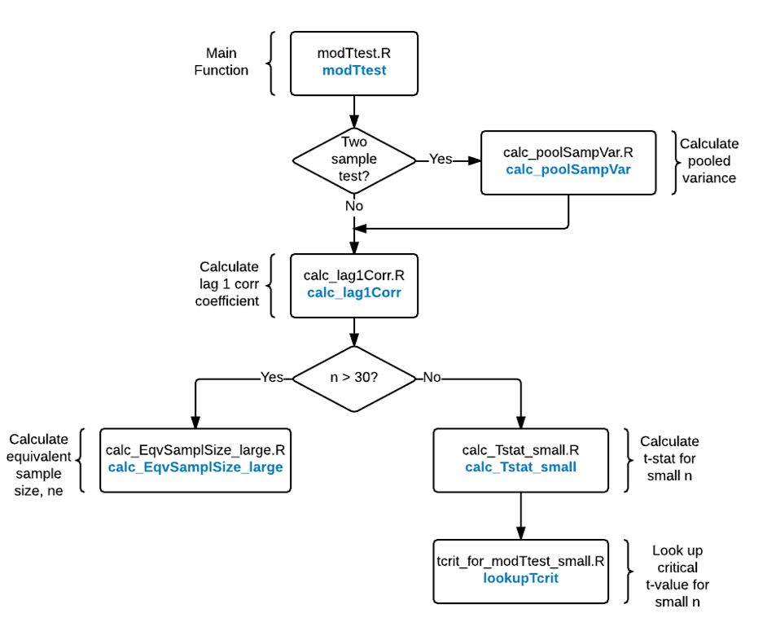

# modTtest
Implementation of the modified t-test proposed by Zwiers and von Storch 1995, J.Clim 8

With high-resolution time series such as pollutant sample (typically 10 s time resolution), neighboring values (in time) are more similar than distant values, and estimates of standard error underestimated sampling variability due to inflation of the number of independent samples and producing greater chances of statistically significant p values. 

To analyze time series data with significant autocorrelation, Zwiers and von Storch (1995) developed a modified t-test which is an extension of a traditional t-test. The modified t-test corrects for the underestimated standard error in autocorrelated time series by reducing the sample size through a first-order autoregressive process. Therefore, the modified t-test produces less biased noise-to-signal ratio by adjusting the underestimated variance in the measurement due to correlation.


Below is the logic model of the modified t-test.



Usage:
Include the following code in the main R code, and call modTtest function

```
source('modTtest.R')
source("calc_lag1Corr.R")
source("calc_EqvSamplSize_large.R")
source("tcrit_for_modTtest_small.R")
source("calc_poolSampVar.R")

```

Example of calling modTtest function:

```
modTtest(vector1, vector2, alternative="two.sided", paired=F)
```

**References**

Zwiers, F. W., & Von Storch, H. (1995). Taking serial correlation into account in tests of the mean. Journal of Climate, 8(2), 336–351. 
